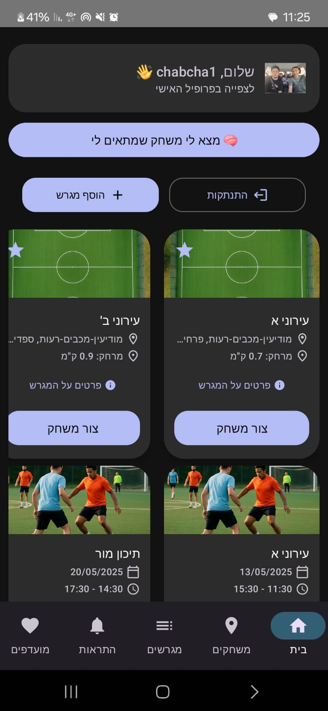
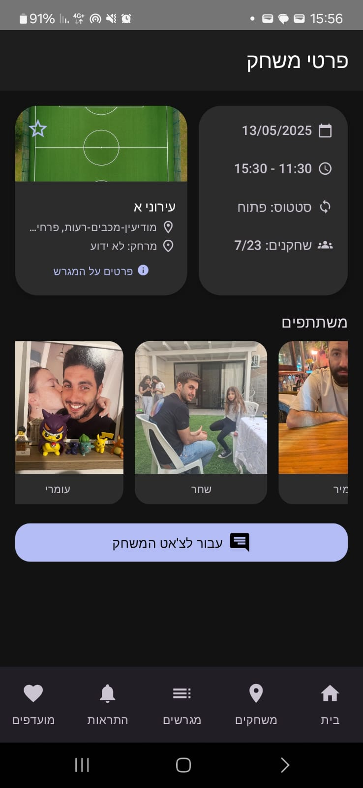
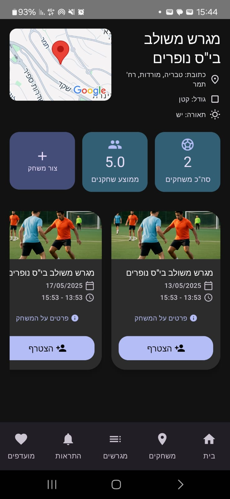
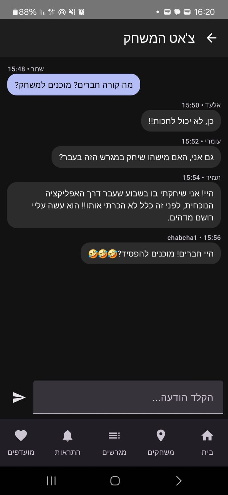

# MatchFinder ⚽

**MatchFinder** is an Android application designed to connect amateur football players by helping them discover, create, and join local football games. The app provides real-time game listings, personalized recommendations using AI, and a user-friendly interface built with modern Android technologies.

## 🔧 Tech Stack

- **Kotlin**
- **Jetpack Compose** – Modern declarative UI
- **Firebase (Auth, Firestore, Storage)**
- **Google Maps API** – Location & distance
- **MVVM Architecture**
- **OpenAI GPT API** – Smart match recommendations

## ✨ Features

- 🔐 Google Sign-In and user authentication  
- 🧑‍💼 User profile with age, location, and preferences  
- 📍 View and filter nearby football fields  
- 🏟️ Create and join local football matches  
- 💬 Real-time chat between game participants  
- 🔔 Push notifications for joined/followed games and fields  
- 🧠 AI-based game recommendations based on user profile  
- 🖼️ Upload and moderate new fields (location + photo)  
- 🧭 Responsive and clean UI using Jetpack Compose  
- ☁️ Realtime backend powered by Firebase

## ▶️ Getting Started

1. Clone the repository:
   ```bash
   git clone https://github.com/itayshabtay452/football-matchmaking-app.git
   ```

2. Open the project in **Android Studio**

3. Add your Firebase config:
   - Download `google-services.json` from your Firebase console
   - Place it under the `app/` directory

4. Make sure Firebase services are enabled:
   - Authentication (Google Sign-In)
   - Firestore Database
   - Firebase Storage

5. Run the app on an emulator or physical device

> Minimum SDK: 26  
> Required: Google Play Services enabled device/emulator

## 🖼️ Screenshots








(*Add more screenshots from the app for better impression.*)

## 📄 License

This project is open-source and available under the MIT License.
